# Keyed Sheet Diff

**Keyed Sheet Diff** (*aka* **KSD**) can compare 2 workbook sheets whose lines are identified by one or more columns.  

## Principles
The **first file** is specified with the `--file1` option.  
The **first sheet** can be specified with the `--sheet1` option, otherwise the first sheet of first file is compared.

The **second file** is specified with the `--file2` option.  
The **second sheet** can be specified with the `--sheet2` option, otherwise the first sheet of second file is compared.

The **result file** is specified  with the `--output` option.


Each input sheet contains one header row and any number of data rows.

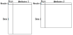

**Note:** on above diagram, keys columns are grouped as first rows, but they can be anywhere.

### Header row
The first row of each input sheet must be a header containing names of columns.  
Those names must be unique. They are case sensitive. Their order can differ between first and second file.

- **Key columns**  
One or more columns (defined with the `--key` option) are used to identify each row.  
If a key column is missing in an input sheet, comparison will fail.
- **Attribute columns**  
Other column names may differ. They should generally be identical to obtain a meaningful comparison.

### Data rows
In both sheets, each data row must have a unique composite key.  
If, in a sheet, 2 rows are identified by the same composite key, comparison will fail.  
The order of rows can differ between first and second file.

### Comparison of data rows
- If a composite key is only present in the first sheet, the row is considered as removed.
- If a composite key is only present in the second sheet, the row is considered as added.
- If a composite key is present in both sheets, rows are either identical or different. A comparison of cells is done.

#### Comparison of attribute cells
Attribute cells are compared when their column names are the same:
- If a column name is only present in the first sheet, the cell is considered as removed.
- If a column name is only present in the second sheet, the cell is considered as added.
- If a column name is present in both sheets, cell contents are compared.

If all attribute cells of matching data rows have identical contents, the 2 rows are identical.  
Otherwise, the 2 rows differ.

### Comparison result
Comparison of rows can be displayed in a dedicated column, the **line mark column**, that is added to input columns.  
The presence and name of this additional column can be forced using the `--line-mark-column` option.  
If present, the content of this column will be:
- **ADDED** for an added row (only present in second sheet),
- **CHANGED** for a changed row,
- **REMOVED** for a removed row (only present in first sheet),
- **SAME** for an identical row.

Comparison of attribute cells can be displayed using marks or colors.  
Colors are used by default with output formats that support them:
- $`\textcolor{red}{\text{red}}`$  is used for removed rows and cells,
- $`\textcolor{blue}{\text{blue}}`$ is used for added rows and cells,
- $`\textcolor{magenta}{\text{magenta}}`$ is used for changed rows and cells.
- $`\textcolor{black}{\text{black}}`$ is used for identical rows and cells.

Marks can be customized (using `--added-mark`, `--changed-mark`, `--removed-mark` and `--unchanged-mark` options).  
Default marks are:
- **<A>** for added cells,
- **<C>** for changed cells,
- **<R>** for removed cells,
- and nothing for identical cells.

Identical rows can be skipped by using the `--no-unchanged-lines` option.  

Marking of added and removed cells can be skipped using the `--no-added-or-removed-marks`. 
In that case, the `line mark column` is necessarily added.

Buy default, first rows of result file are are those of the second file, completed with removed rows.  
If the `--sort-lines` option is used, then rows of result file are sorted using their composite key.
The order of declaration of keys matters in that case.

### Synthesis
A synthesis of comparison can be:
- displayed on console (using `--synthesis` option)
- inserted in an additional sheet of the output file (using `--save-synthesis` option).

## Formats
**CSV**, **XLS**, **XLSX** and **ODS** are supported as input and output formats.  
The compared sheets don't need to use the same format.  
However, using the same input format for both sheets may give better results.

The output format may differ from input format(s).

**Warning:** **ODS** output format has currently more limitations than `Office` formats, and is slower to process.

When using **CSV**, one can optionally specify:
- the used separator, using the `--separator` option,
- the file character set, using the `--charset` option.

**Warning:** all **CSV** files must use the same separator and character set.


## Examples
The 2 input sheets are:  
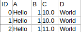 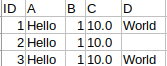

There is 1 `key` column: ID.  
There are 4 `attribute` columns: A, B, C and D.

Minimal mandatory options, if the sheets to compare are the first ones, are:
`--file1` *<file1>* `--file2` *<file2>* `--output` *<output>* `--key` ID  
Otherwise, one must add `--sheet1` *<sheet1>* option if the sheet of first file *<file1>* is not the first one,
and `--sheet2` *<sheet2>* option if the sheet of second file *<file2>* is not the first one.

Depending on additional options and on output format, result will be:

<table>
   <thead>
      <tr><th>Additional options</th><th>Office</th><th>CSV</th><th>Notes</th></tr>
   </thead>
   <tbody>
      <tr>
         <td></td>
         <td>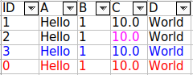</td>
         <td>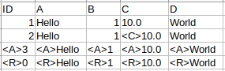</td>
         <td></td>
      </tr>
      <tr>
         <td><code>--no-added-or-removed-marks</code></code></td>
         <td>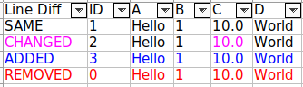</td>
         <td>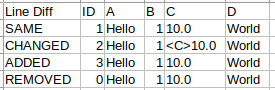</td>
         <td>A <code>Line Diff</code> column has been automatically added, even for Office formats.</td>
      </tr>
      <tr>
         <td><code>--line-mark-column</code> Diff</td>
         <td>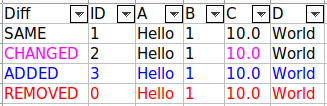</td>
         <td>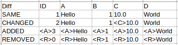</td>
         <td></td>
      </tr>
      <tr>
         <td><code>--show-change-details</code></td>
         <td>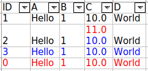</td>
         <td>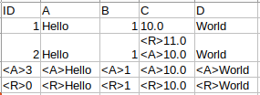</td>
         <td></td>
      </tr>
      <tr>
         <td><code>--show-change-details<br>--line-mark-column</code> Diff</td>
         <td>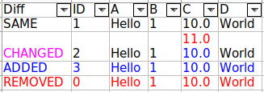</td>
         <td>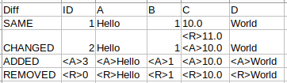</td>
         <td></td>
      </tr>
      <tr>
         <td><code>--show-change-details<br>--line-mark-column</code> Diff<br><code>--no-unchanged-lines<br>--sort-lines</code></td>
         <td>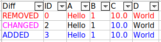</td>
         <td>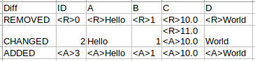</td>
         <td></td>
      </tr>
      <tr>
         <td><code>--show-change-details<br>--line-mark-column</code> Diff<br><code>--no-unchanged-lines<br>--sort-lines<br>--no-added-or-removed-marks</code></td>
         <td>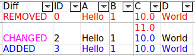</td>
         <td>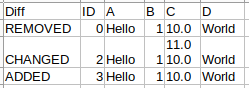</td>
         <td></td>
      </tr>
   </tbody>
</table>

If the `--save-synthesis` option is enabled, an additional sheet is generated with that content:

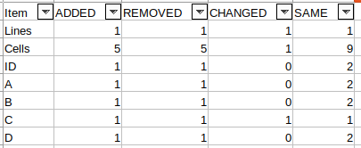

- `Lines` gives the count of the 4 possible values in `line mark column` (**Diff** or **Line Diff** in above example), even if unchanged lines are filtered out.
- `Cells` gives the count for all cells, including added and removed lines.
- One line is created for each column. In the above example, there are 5 columns.


## Common errors

The following table lists commons errors, their symptoms and solutions.

<table>
   <thead>
      <tr><th>Symptoms</th><th>Cause</th><th>Solution</th></tr>
   </thead>
   <tbody>
      <tr>
         <td>KSD probably fails with an exception like:<br><code>Missing keys: [...] in file1/file2 header: [...]</code></td>
         <td>Both input CSV files <b>MUST</b> use the same separator and character set.<br>They don't.</td>
         <td>Convert one or both files in order to use the same separator and character set.</td>
      </tr>
      <tr>
         <td>KSD probably fails with an exception like:<br><code>Missing keys: [...] in file1/file2 header: [...]</code></td>
         <td>Input CSV file(s) <b>MUST</b> be compliant with the default or specified separator and character set.<br>It isn't / they aren't.<br></td>
         <td>Convert CSV file(s) to used the specified separator and character set,<br>or specify correct separator and character set.</td>
      </tr>
      <tr>
         <td>KSD fails.<br>An exception is thrown with a message similar to:<br><code>Missing keys: [...] in file1/file2 header: [...]</code></td>
         <td>Headers <b>MUST</b> be compliant with specified keys.<br>They aren't.</td>
         <td>Fix key names in input files or command line, or add missing key column(s) with appropriate name(s).</td>
      </tr>
      <tr>
         <td>KSD succeeds.<br>Many or all attribute cells are marked as <code>ADDED</code> or <code>REMOVED</code>.</td>
         <td>Headers <b>ARE</b> case sensitive. Attributes of headers <b>MUST</b> be consistent.<br>They aren't.</td>
         <td>Make sure both headers use the same names and case.</td>
      </tr>
      <tr>
         <td>KSD fails.<br>An exception is thrown with a message similar to:<br><code>Invalid header (duplicate names): [...]</code></td>
         <td>Header names <b>MUST</b> be unique.<br>They aren't.</td>
         <td>Fix header names so that they are all different.</td>
      </tr>
   </tbody>
</table>


## Options
Options of KSD are:

```
    --added-mark <arg>            Optional mark for added cells (default:
                                  "<A>").
    --args-file <arg>             Name of the file from which options can
                                  be read.
                                  A line is either ignored or interpreted
                                  as a single argument (option or value).
                                  A line is ignored when it is empty or
                                  starts by any number of white spaces
                                  followed by '#'.
                                  A line that only contains white spaces
                                  is an argument.
    --auto-size-columns           Auto size columns. This may take longer
                                  time.
    --changed-mark <arg>          Optional mark for changed cells
                                  (default: "<C>").
    --charset <arg>               Optional name of the charset for csv
                                  files (default: platform default
                                  charset).
    --file1 <arg>                 Name of the first csv, xls, xlsx or ods
                                  input file.
    --file2 <arg>                 Name of the second csv, xls, xlsx or ods
                                  input file.
 -h,--help                        Prints this help and exits.
    --key <arg>                   Name of key column(s).
    --line-mark-column <arg>      Optional name of a line mark column.
                                  (default: "Line Diff" if necessary).
    --no-added-or-removed-marks   Do not print added or removed marks.
                                  This forces insertion of the line mark
                                  column.
    --no-colors                   Do not use colors with output formats
                                  that support colors.
    --no-unchanged-lines          Do not output unchanged lines.
    --output <arg>                Name of the csv, xls, xlsx or ods output
                                  file.
    --removed-mark <arg>          Optional mark for removed cells
                                  (default: "<R>").
    --save-synthesis              Save synthesis in output file, in a
                                  dedicated sheet.
    --separator <arg>             Optional char separator for csv files
                                  (default: ';').
    --sheet <arg>                 Name of the delta sheet in the output
                                  file. (default: "Delta").
    --sheet1 <arg>                Name of the sheet in the first xls, xlsx
                                  or ods input file. If omitted, the first
                                  sheet is loaded
    --sheet2 <arg>                Name of the sheet in the second xls,
                                  xlsx or ods input file. If omitted, the
                                  first sheet is loaded
    --show-change-details         If enabled, show value 1 (with removed
                                  mark or color) and value 2 (with added
                                  mark or color).
                                  Otherwise, show value 2 (with changed
                                  mark or color).
    --sort-lines                  Sort lines using keys. Order of key
                                  columns declaration matters.
    --synthesis                   Print a synthesis of differences.
    --unchanged-mark <arg>        Optional mark for unchanged cells
                                  (default: "").
 -v,--version                     Prints version and exits.
    --verbose                     Print progress messages.
```
